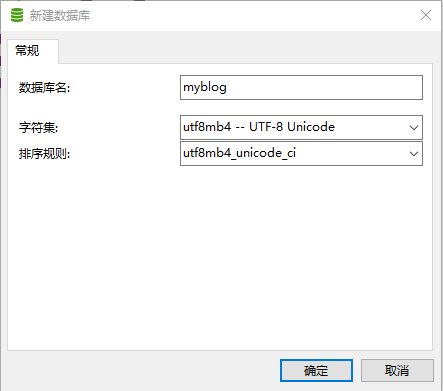

### 在线预览地址：43.143.167.129

### 安装依赖

```
npm install
```

根目录下的 server 文件为 node 服务端

```
cd server
node index.js
```

运行项目

```
 npm run serve
```

### 数据库文件

在 navicat 新建数据库



### 首页界面


### 后台界面

超级管理员可以进入后台进行查看博客数据


